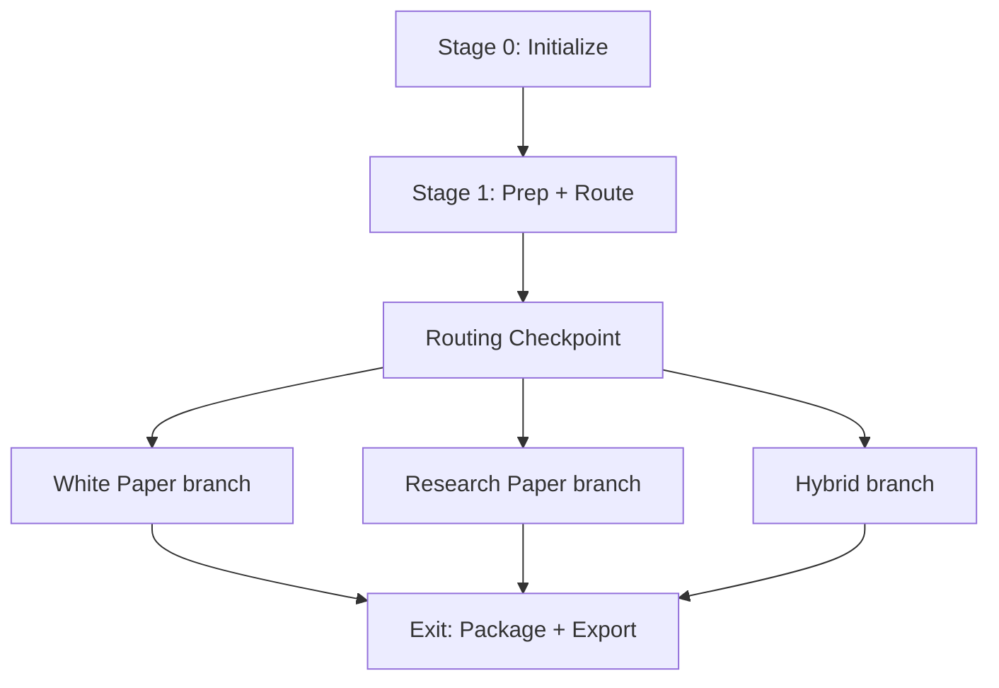

# Workflow Reference

## Stages Overview

| Stage | All Modes | White Paper | Research Paper | Hybrid |
|-------|-----------|-------------|------------|--------|
| 0 | Initialize | | | |
| 1 | Prep + Route | | | |
| - | Routing Checkpoint | | | |
| 2 | | W2: Perspectives | D2: Planning | H2: Conceptual Framing |
| 3 | | W3: Argument | D3: Support | H3: Evidence Support |
| 4 | | W4: Draft (.md) | D4: Draft (.tex) | H4: Merged Draft |
| 5 | | W5: Review+IP | D5: Review+IP | H5: Dual Review |
| 6 | | W6: Executive | D6: Finalize | H6: Combined Export |
| Exit | Package + Export | | | |

## Mode routing diagram

After prep, `classify_materials.py` and `route_mode.py` produce a recommended mode (white paper, research paper, or hybrid). The routing checkpoint confirms or overrides that choice before mode-specific stages run.



Low-confidence routing (see failure modes) may require an explicit user override before continuing on a branch.

## Workspace Layout

```
workspace/
  intent.json            ← Declared goals and constraints for the run
  route.json             ← Mode routing decision and confidence (from route_mode.py)
  ip_policy.json         ← IP/redline rules for scan_redlines.py
  materials_passport.json ← Classified materials summary (from classify_materials.py)
  inputs/
    raw_materials/       ← User's source files
    idea.md              ← Core contribution and research questions
    experimental_log.md  ← Experiments, results, observations
    venue_profile.md     ← Target venue requirements
    template.tex         ← LaTeX template (optional)
    materials_manifest.json
    figures_manifest.json
  planning/
    outline.json         ← Paper structure contract
    figure_plan.json     ← What figures exist / need creation
    literature_plan.json ← Search queries and coverage areas
    claim_ledger.json    ← Claims mapped to evidence
    results_inventory.json
    perspectives.json    ← Stakeholder / framing perspectives (mode-specific)
    question_tree.json   ← Structured questions driving the argument
  citations/
    citation_pool.json   ← Verified citation metadata
    refs.bib             ← BibTeX bibliography
  figures/
    generated/           ← Figures created during workflow
    supplied/            ← Figures from raw materials
    captions.json        ← Figure captions and paths
  tables/
    generated/           ← Table LaTeX snippets
  drafts/
    paper.tex            ← Working draft
    argument_graph.md    ← Argument structure (links claims and narrative)
    sections/            ← Optional section intermediates
  reviews/
    review_round_N.md    ← Review notes per round
    scorecard.json       ← Quality scores
  exports/               ← Packaged outputs (see package_exports.py)
  final/
    paper.tex            ← Final manuscript
    paper.pdf            ← Compiled PDF
    refs.bib
    figures/
    submission_bundle.zip
  logs/
    run_log.md           ← Session history
    checkpoints.md       ← Stage completion tracking
```

## Resuming Work

Re-invoke `/folio` on an existing workspace. The skill reads `logs/checkpoints.md` to detect the last completed stage and offers to resume from the next one.

You can also request a specific stage re-run: "Re-run the review stage on this workspace."

## Running Individual Scripts

All scripts accept a workspace path as their only argument:

```bash
cd plugins/folio && python scripts/init_workspace.py workspace/
cd plugins/folio && python scripts/prep_materials.py workspace/
cd plugins/folio && python scripts/validate_inputs.py workspace/
cd plugins/folio && python scripts/build_claim_ledger.py workspace/
cd plugins/folio && python scripts/verify_citations.py workspace/
cd plugins/folio && python scripts/check_artifacts.py workspace/
cd plugins/folio && bash scripts/compile_package.sh workspace/
```
